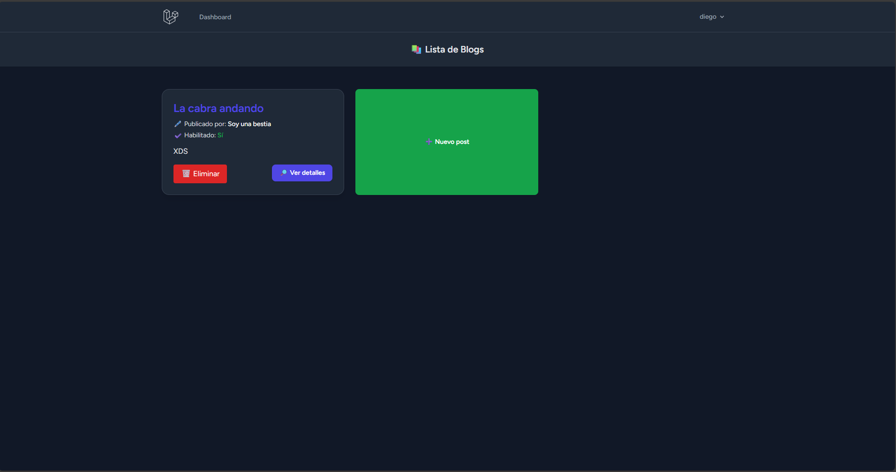

# 📚 Blog Laravel

<p align="center"><a href="https://laravel.com" target="_blank"></a></p>

<p align="center">
<a href="https://github.com/laravel/framework/actions"></a>
<a href="https://packagist.org/packages/laravel/framework"></a>
<a href="https://packagist.org/packages/laravel/framework"></a>
<a href="https://packagist.org/packages/laravel/framework"></a>
</p>

## About Laravel

Laravel is a web application framework with expressive, elegant syntax. We believe development must be an enjoyable and creative experience to be truly fulfilling. Laravel takes the pain out of development by easing common tasks used in many web projects, such as:

- [Simple, fast routing engine](https://laravel.com/docs/routing).
- [Powerful dependency injection container](https://laravel.com/docs/container).
- Multiple back-ends for [session](https://laravel.com/docs/session) and [cache](https://laravel.com/docs/cache) storage.
- Expressive, intuitive [database ORM](https://laravel.com/docs/eloquent).
- Database agnostic [schema migrations](https://laravel.com/docs/migrations).
- [Robust background job processing](https://laravel.com/docs/queues).
- [Real-time event broadcasting](https://laravel.com/docs/broadcasting).

Laravel is accessible, powerful, and provides tools required for large, robust applications.

## Learning Laravel

Laravel has the most extensive and thorough [documentation](https://laravel.com/docs) and video tutorial library of all modern web application frameworks, making it a breeze to get started with the framework.

You may also try the [Laravel Bootcamp](https://bootcamp.laravel.com), where you will be guided through building a modern Laravel application from scratch.

If you don't feel like reading, [Laracasts](https://laracasts.com) can help. Laracasts contains thousands of video tutorials on a range of topics including Laravel, modern PHP, unit testing, and JavaScript. Boost your skills by digging into our comprehensive video library.

## Laravel Sponsors

We would like to extend our thanks to the following sponsors for funding Laravel development. If you are interested in becoming a sponsor, please visit the [Laravel Partners program](https://partners.laravel.com).

---

## 🚀 Descripción

Este es un **Blog** construido con Laravel que permite:

- Crear, leer, actualizar y eliminar posts (CRUD).
- Registro de usuarios.
- Manejo de sesiones y roles básicos.
- Base de datos relacional con Modelo Conceptual de Datos (MCD) simple.

---


---

## img




---

## 🛠️ Tecnologías usadas

- PHP 8.x
- Laravel 9.x
- MySQL (Base de datos XAMPP)
- Blade (motor de plantillas Laravel)
- TailwindCSS para estilos
- XAMPP para entorno local

---

## ⚙️ Requisitos Previos

- Tener instalado [XAMPP](https://www.apachefriends.org/es/index.html) (Apache + MySQL)
- Composer instalado en tu sistema (https://getcomposer.org/)
- PHP configurado (XAMPP trae PHP)

---

## 🗂️ Estructura del proyecto
/app -> Controladores, Modelos, etc. /resources -> Vistas (Blade templates) /routes -> Archivo web.php para rutas /database -> Migraciones y seeds /public -> Archivos públicos (css, js, imágenes)

---

## ⚡ Instalación y Configuración

1. **Clonar el repositorio:**
    ```bash
    git clone https://tu-repositorio.git
    cd nombre-del-proyecto
    ```

2. **Instalar dependencias con Composer:**
    ```bash
    composer install
    ```

3. **Copiar archivo de entorno y configurar variables:**
    ```bash
    cp .env.example .env
    ```
    Edita el archivo [.env](http://_vscodecontentref_/0) con tus credenciales de base de datos:
    ```
    DB_CONNECTION=mysql
    DB_HOST=127.0.0.1
    DB_PORT=3306
    DB_DATABASE=laravel_db
    DB_USERNAME=root
    DB_PASSWORD=
    ```

4. **Generar la clave de la aplicación:**
    ```bash
    php artisan key:generate
    ```

5. **Ejecutar migraciones y seeders:**
    ```bash
    php artisan migrate --seed
    ```

6. **Instalar dependencias de frontend y compilar assets:**
    ```bash
    npm install
    npm run dev
    ```

7. **Levantar el servidor de desarrollo:**
    ```bash
    php artisan serve
    ```

---

## 🧪 Pruebas

Para ejecutar las pruebas, usa:

```bash
composer run dev 
```
